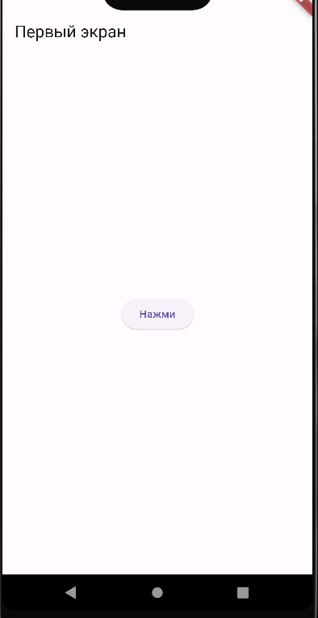

# Лабораторная работа №1. Создание activity и передача параметров между ними 

   Цель работы: Знакомство с интерфейсом среды программирования. Изучение
структуры проекта    
    *Выполнила*: Иволгина Елизавета  
    *Язык*: Dart

## Описание
Приложение состоит из двух экранов:

* Первый экран (Activity 1) - содержит кнопку для перехода на второй экран.
* При нажатии на кнопку передает параметр lastName на второй экран

  


* Второй экран (Activity 2) - отображает переданный параметр (фамилию).

  
****

## Как работает?
**Первый экран**
(Activity1)   

Содержит ```AppBar``` c заголовком экрана:

```
appBar: AppBar(title: Text('Первый экран'))
```

В центре экрана находится кнопка:
``` 
ElevatedButton(
  onPressed: () {
    // Переход ко второму экрану
  },
  child: Text(':Нажми'),
)
```
При нажатии на кнопку вызывается ```Navigator.push```, который создает новый маршрут и передает фамилию:
```
Navigator.push(
  context,
  MaterialPageRoute(
    builder: (context) => Activity2(lastName: 'Иволгина'),
  ),
)
```
**Второй экран**
(Activity2) 
Также держит ```AppBar``` c заголовком:

```
appBar: AppBar(title: Text('Второй экран'))
```
В центре экрана размещается текст, показывающий переданый параметр(в данном случае - фамилию)

```
  body: Center(
        child: Text(
          'Переданный параметр: $lastName',
          style: TextStyle(fontSize: 24),
        ),
      ),
)
```
**Передача данных**
При нажатии на кнопку на первом экране вызывается метод ```Navigator.push```, который создает новый экран и передает параметры   
Activity1:

```
Navigator.push(
    context,
    MaterialPageRoute(
        builder: (context) => Activity2(lastName: 'Иволгина')
```
Activity2:
```
child: Text(
          'Переданный параметр: $lastName',
          style: TextStyle(fontSize: 24),
        )
```
****
## Как собрать    
* Установите Flutter SDK.
* Настройте Android studio: Установите плагины Flutter и Dart.
1. Загрузите репозиторий
2. Запустите Android Studio
3. Нажмите на "Open" и выберите папку с проектом
4. Выберите эмулятор(или подключите реальное устройство)\
5. Нажмите "Run"
****
